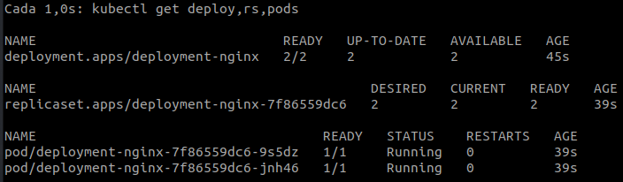
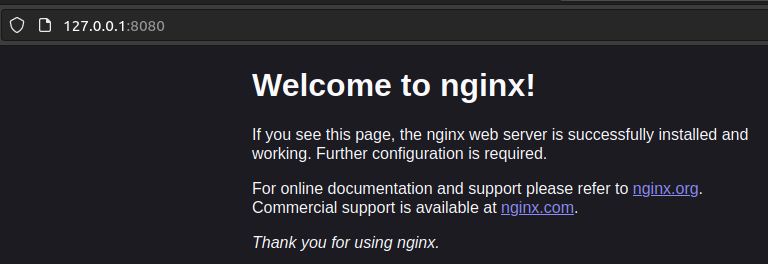
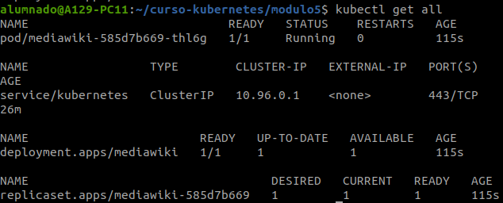
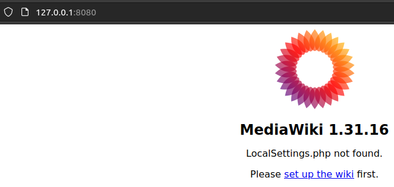
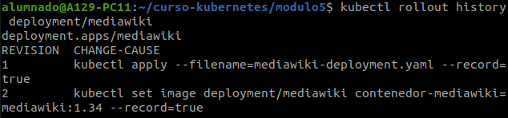
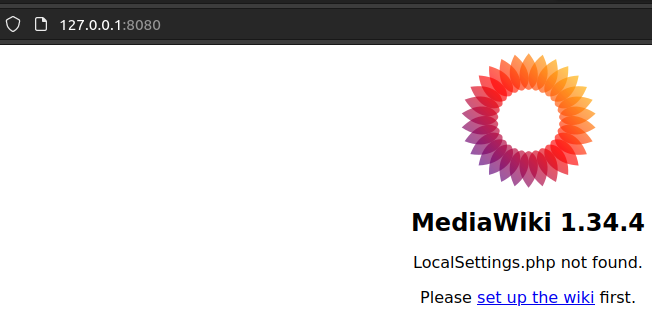
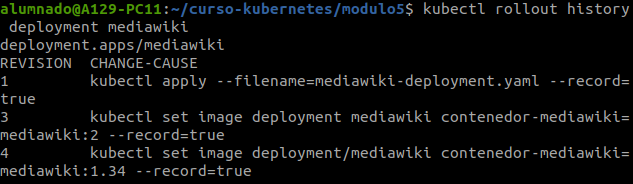

# Módulo 5: Deployments

La creación de un Deployment crea un ReplicaSet y los Pods correspondientes. Por lo tanto en la definición de un Deployment se define también el ReplicaSet asociado (los parámetros **replicas**, **selector** y **template**). Los atributos relacionados con el Deployment que hemos indicado en la definición son:

- **revisionHistoryLimit**: Indicamos cuántos ReplicaSets antiguos deseamos conservar, para poder realizar *rollback* a estados anteriores. Por defecto, es 10.
- **strategy**: Indica el modo en que se realiza una actualización del Deployment. Es decir, cuando modificamos la versión de la imagen del Deployment, se crea un ReplicaSet nuevo y ¿qué hacemos con los pods?:
    - **Recreate**: elimina los Pods antiguos y crea los nuevos.
    - **RollingUpdate**: va creando los nuevos Pods, comprueba que funcionan y se eliminan los antiguos; es la opción por defecto.

Además, hemos introducido un nuevo parámetro al definir el contenedor del Pod: con el parámetro *ports* hemos indicado el puerto que expone el contenedor (containerPort) y le hemos asignado un nombre.

Comandos:
---

Cuando creamos un Deployment, se creará un ReplicaSet asociado, que creará y controlará los Pods que hayamos indicado.

``kubectl apply -f nginx-deployment.yaml``

Podemos ver el estado del Deploy y los Pods con:

``watch -n 1 kubectl get deploy,rs,pods``

Al igual que con los ReplicaSet, los Deployments también se pueden escalar:

``kubectl scale deployment deployment-nginx --replicas=<Número-de-Pods>``

Para poder acceder a la aplicación del Deployment, necesitaremos redirigir los puertos de **UN SOLO POD** al exterior (al igual que cuando usamos -p en Docker):

``kubectl port-forward deployment/deployment-nginx 8080:80``

Si accedemos a la IP de nuestra máquina (o localhost, por ejemplo) con el puerto 8080 (que es el que hemos redirigido del puerto 80), veremos como se nos muestra la aplicación:

Si queremos ver los logs generados en los Pods de un Deployment:

``kubectl logs deployment/deployment-nginx``

Si queremos obtener información detallada del recurso Deployment que hemos creado:

``kubectl describe deployment deployment-nginx``

Para eliminar el Deployment (junto al ReplicaSet y sus Pods asociados) usamos el comando:

``kubectl delete deployment deployment-nginx``

# Ciclo de vida:

Por cada nueva versión que se desarrolla de nuestra aplicación podemos crear una nueva imagen del contenedor que podemos versionar utilizando la etiqueta del nombre de la imagen.

Por lo tanto, al crear un Deployment indicaremos la imagen desde la que se van a crear los Pods. Al indicar la imagen podremos indicar la etiqueta que nos indica la versión de la aplicación que vamos a implantar.

Una vez que hemos creado un Deployment a partir de una imagen de una versión determinada, tenemos los Pods ejecutando la versión indicada de la aplicación.

Si nos fijamos en el fichero *mediawiki-deployment.yaml* en el repositorio, vamos a desplegar la versión **1.31** de la aplicación **mediawiki**.
Creamos el despliegue con la siguiente instrucción:

``kubectl apply -f mediawiki-deployment.yaml --record``

Con la opción **--record** vamos a registrar las instrucciones que vamos a ejecutar a continuación para ir actualizando el despliegue. De esta forma al ver el historial de modificaciones veremos las instrucciones que han provocado cada actualización.

Podemos comprobar los recursos que hemos creado:

``kubectl get all``

Abrimos el puerto de la misma manera que el apartado anterior para comprobar la versión de mediawiki:

``kubectl port-forward deployment/mediawiki 8080:80``

# Actualizar un Deployment

Para actualizar a la versión más reciente de mediawiki, tendremos que modificar nuestro Deployment:

Hay dos opciones:
- Modificando el archivo yaml de *mediawiki:1.31* a *mediawiki:1.34*.
- Ejecutando el siguiente comando:

``kubectl set image deployment/mediawiki contenedor-mediawiki=mediawiki:1.34 --record``

Hemos modificado la imagen pero ¿cómo se aplican los cambios?
- Por defecto, se despliega con **Recreate** que elimina los Pods antiguos y crea los nuevos.
- También tenemos **RollingUpdate**, en él se van creando los nuevos Pods, se comprueba que funcionan y se eliminan los antiguos.

Podemos ver el estado del Deployment con:

``kubectl get all``

También, podemos ver el historial de versiones con:

``kubectl rollout history deployment/mediawiki``

Volvemos a abrir los puertos:

``kubectl port-forward deployment/mediawiki 8080:80``

# Rollback del Deployment

Hay veces que necesitamos un *rollback* (volver a una versión anterior) o un *rollout* (que es lo mismo).

Como hemos comentado, las actualizaciones de los Deployment van creando nuevos ReplicaSet, y se va guardando el historial de ReplicaSet anteriores. Deshacer un ***Rollout*** será tan sencillo como activar uno de los ReplicaSet antiguos.

Ahora vamos a desplegar una versión que nos da un error (la versión 2 de la aplicación no existe, no existe la imagen mediawiki:2). ¿Podremos volver al despliegue anterior?

``kubectl set image deployment mediawiki contenedor-mediawiki=mediawiki:2 --record``

Dependiendo de la forma de despliegue, esto puede provocar que la aplicación se quede en la versión anterior (RollingUpdate) o que no haya ningún Pod válido desplegado (Recreate).

En cualquier caso, se puede volver a la versión anterior del despliegue mediante rollout:

``kubectl rollout undo deployment/mediawiki``

Recuerda que podemos ver el estado con:

``kubectl get all``

Y para terminar, comprobamos el historial de actualizaciones con:

``kubectl rollout history deployment mediawiki``

