# Módulo 6: Acceso a las aplicaciones - Servicios

Los servicios nos permiten acceder a las aplicaciones que hemos desplegado en el cluster.
- Un *Service* nos permite acceder a un conjunto de pods (que se han creado a partir de un Deployment) que implementan una aplicación (Por ejemplo: acceder a un servidor web, a una servidor de base de datos, etc).
- A cada Pod se le asigna una IP a la que no se puede acceder directamente, por lo tanto necesitamos un Service que nos ofrece una dirección virtual **(CLUSTER-IP)** y un nombre que identifica al conjunto de Pods que representa, al cual nos podemos conectar.
- La conexión al Service se puede realizar desde otros Pods o desde el exterior (mediante la generación aleatoria de un puerto).
- Si el Deployment que hemos creado tiene más de un Pod asociado, el Service que representa el acceso a esta aplicación balanceará la carga entre los Pods.
- En el cluster existirá un componente que nos ofrece un servicio DNS. Cada vez que creamos un Service se actualizará el DNS para resolver el nombre que hemos asignado al Service con la IP virtual **(CLUSTER-IP)** que se le ha asignado.

Nota:
---
Cuando tenemos más de un Pod ofreciendo el mismo servicio, realmente tenemos un clúster y es importante distinguir entre servicios sin estado (*stateless*) o con estado (*stateful*).

En un servicio sin estado (por ejemplo, un servidor web que sirva contenido estático), las peticiones son independientes y se pueden servir por diferentes nodos sin problema, aunque en el caso de un servidor web, deberíamos asegurarnos previamente de que el directorio con los datos es el mismo. Un servicio de este tipo lo podemos escalar con un despliegue sin problema.

Por otra parte, si el servicio tiene estado (por ejemplo, un servidor de bases de datos), una petición puede depender de otra anterior, por lo que puede haber incoherencias si simplemente creamos un cluster de nodos iguales. En este tipo de servicios, es necesaria una configuración adicional que controle el estado y que haga que los datos que sirve cada Pod son coherentes entre sí.

Tipos de servicios:
---

- **ClusterIP**: Solo se permite el acceso interno a un Service de este tipo.
- **NodePort**: Abre un puerto, para que el Service sea accesible desde el exterior.
- **LoadBalancer**: Este tipo sólo está soportado en servicios de cloud público (Google Kubernetes Engine, Azure Kubernetes Service o Amazon Web Services). El proveedor asignará un recurso de balanceo de carga para el acceso a los Services.

# Services: NodePort

Suponemos que tenemos desplegado nginx usando el fichero *nginx-deployment.yaml*:

``kubectl apply -f nginx-deployment.yaml``

Tenemos dos opciones:
- Usar el comando:

``kubectl expose deployment/nginx --port=80 --type=NodePort``

- Usar el fichero *nginx-srv.yaml*.

**NOTA:** La definición de un Service de tipo **ClusterIP** sería exactamente igual, pero cambiando el parámetro *type*.

Y aplicamos el Service con:

``kubectl apply -f nginx-srv.yaml``

Para ver los Services que tenemos creado:

``kubectl get services``

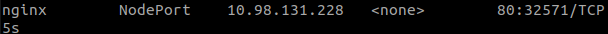

Podemos ver una descripción extensa del servicio con:

``kubectl describe service/nginx``

En la captura anterior vemos que nos ha asignado el puerto *32571*, con el comando: ``minikube ip`` vemos nuestra IP para poder acceder al servicio.

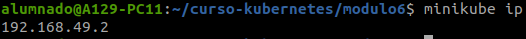

Accedemos al navegador:

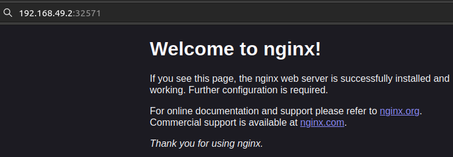

# Services: ClusterIP

En esta ocasión vamos a desplegar una base de datos MariaDB. En este caso no vamos a necesitar acceder a la base de datos desde el exterior, pero necesitamos que los Pods de otro despliegue puedan acceder a ella. Por lo tanto vamos a crear un Service de tipo ClusterIP.

Para el despliegue del servicio usaremos el fichero *mariadb-deployment.yaml*. Y para la creación del servicio usaremos el fichero *mariadb-srv.yaml*.

Aplicamos los comandos:
	kubectl apply -f mariadb-deployment.yaml
	kubectl apply -f mariadb-srv.yaml

Comprobamos el Service creado:

``kubectl get services``

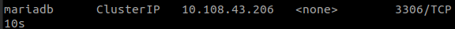

Podemos ver más información con:

``kubectl describe service/mariadb``

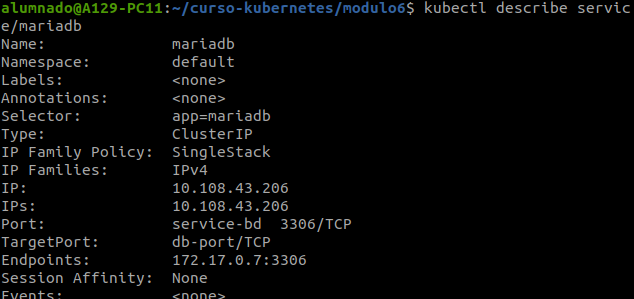

Podemos comprobar que no se ha mapeado un puerto aleatorio para que accedamos usando la IP del nodo master. Los Pods que accedan a la IP 10.108.43.206 o al nombre mariadb y al puerto 3306 estarán accediendo al Pod (172.17.0.7:3306) del despliegue de mariadb.

Para eliminar un servicio usaremos el comando:

``kubectl delete service mariadb``

# Servicio DNS en Kubernetes

Existe un componente de Kubernetes llamado CoreDNS, que ofrece un servidor DNS interno para que los Pods puedan resolver diferentes nombres de recursos (Services, Pods, ...) a direcciones IP.

Cada vez que se crea un nuevo recurso Service se crea un registro de tipo A con el nombre:

``<nombre_servicio>.<nombre_namespace>.svc.cluster.local.``

Comprobemos el servidor DNS:
---

Partimos del punto anterior donde tenemos creados los dos Services:

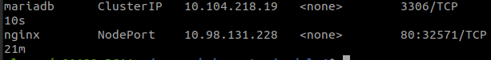

Para comprobar el servidor DNS de nuestro cluster y que podemos resolver los nombres de los distintos Services, vamos a usar un Pod (*busybox.yaml*) creado desde una imagen busybox.

``kubectl apply -f busybox.yaml``

¿Qué servidor DNS está configurado en los Pods que estamos creando? Podemos ejecutar la siguiente instrucción para comprobarlo:

``kubectl exec -it busybox -- cat /etc/resolv.conf``

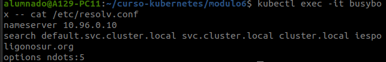

- El servidor DNS tiene asignado la IP del cluster 10.96.0.10.
- Podemos utilizar el nombre corto del Service, porque buscará el nombre del host con en el parámetro *search*.

Vamos a comprobar que realmente se han creado dos registros A para cada uno de los Service, haciendo consultas DNS:
- Para nginx:
	
``kubectl exec -it busybox -- nslookup nginx``

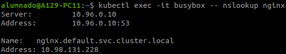

- Para mariadb:

``kubectl exec -it busybox -- nslookup mariadb``

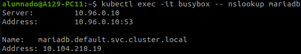

# Ingress Controller

Hasta ahora para acceder a un Service habíamos usado NodePort (con un puerto aleatorio) y sin contar LoadBalancer porque para servicios en la nube, descubriremos una forma de hacerla mediante proxy inverso y que gracias a la API de Kubernetes podemos acceder mediante nombres.

**Instalación en Minikube:**

``minikube addons enable ingress``

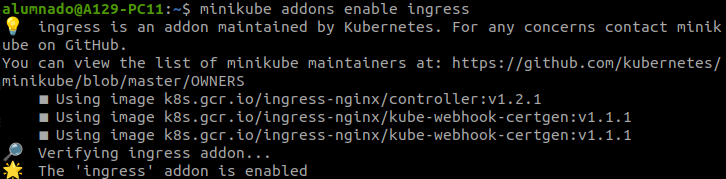

Para comprobar si tenemos instalado el componente, podemos visualizar los Pods creados en el namespace *ingress-nginx*. Este espacio de nombre se ha creado para desplegar el controlador de ingress Por lo tanto al ejecutar:

``kubectl get pods -n ingress-nginx``

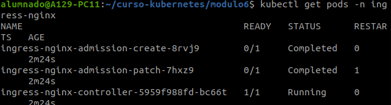

El recurso Ingress para acceder a nuestro despliegue de nginx lo tenemos en el fichero *ingress.yaml*.

Para crear el recurso Ingress:

``kubectl apply -f ingress.yaml``

Y podemos ver el recurso Ingress que hemos creado:

``kubectl get ingress``

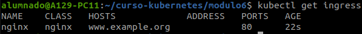

Si queremos obtener información detallada:

``kubectl describe ingress/nginx``

Obtenemos la IP de Minikube:

``minikube ip``

Como no tenemos un servidor DNS que nos permita gestionar los nombres que vamos a utilizar para el acceso a las aplicaciones, vamos a usar resolución estática. Para ello como root añadimos una nueva línea en el fichero /etc/hosts, indicando el nombre (www.example.org) y la ip a la que corresponde, la ip del nodo master:

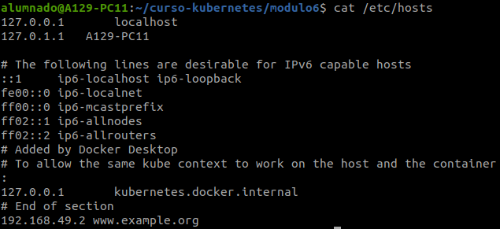

Comprobamos en el navegador el funcionamiento:

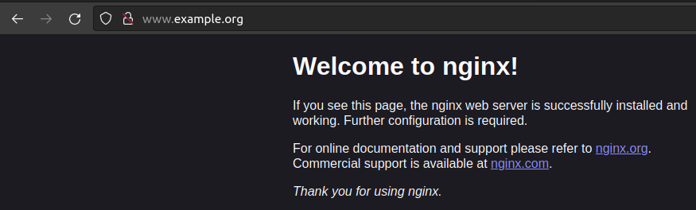
